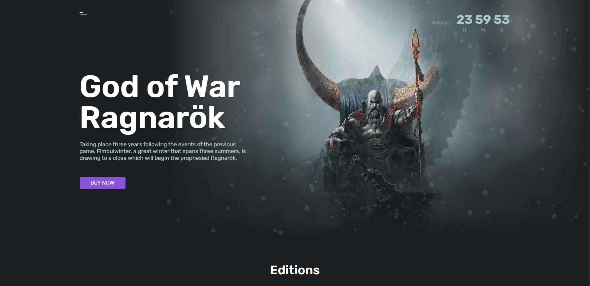

# Game Landing

[Demo](https://deniskulik.github.io/game-landing)

## Description
The Game Landing Page project serves as a visually appealing and informative platform to introduce and promote a game. It provides users with an enticing preview of the game, its key features, and how to get started. Whether you're a game developer or marketer, this landing page can help create a strong impression and generate interest in your game.

## Screenshots

## Built With
This is a game landing project built using `React`, `TypeScript`, `Styled-components`, `react-alice-carousel`, `react-awesome-reveal`, and `react-scroll`. This landing page is designed to promote and showcase an exciting game.
